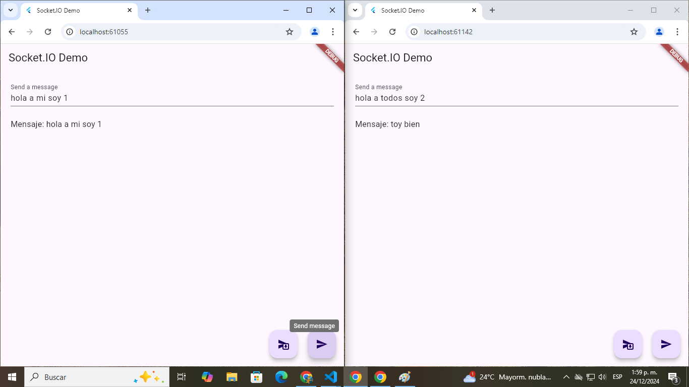

# 🚀 Flutter WebSocket Client-Server Project

[](https://flutter.dev)

[](LICENSE)



## 📚 Descripción

Este proyecto tiene como objetivo crear una comunicación en tiempo real entre un cliente en **Flutter** y un servidor en **Node.js**. El servidor está implementado con `Socket.IO` para gestionar las conexiones WebSocket, mientras que el cliente en Flutter utiliza el paquete `socket_io_client` para conectarse al servidor y enviar/recibir mensajes.


## 🎯 Objetivo del Proyecto

- Implementar un cliente en **Flutter** que se conecta a un servidor WebSocket.
- Crear un servidor WebSocket en **Node.js** utilizando `Socket.IO`.
- Gestionar eventos personalizados de comunicación, como enviar mensajes a todos los usuarios o a un solo usuario.
- Mejorar la estructura y flujo de datos del cliente y servidor.

## 🛠️ Características

- **Servidor WebSocket en Node.js**: Usando `Socket.IO` para gestionar las conexiones y mensajes.
- **Cliente WebSocket en Flutter**: Usando el paquete `socket_io_client` para la conexión.
- **Mensajes Bidireccionales**: Soporte para enviar y recibir mensajes en tiempo real.
- **Envío de mensajes complejos**: Capacidad para enviar objetos estructurados como mensajes, incluyendo un campo user y message.
- **StreamBuilder para actualización en tiempo real**: En el cliente, los mensajes se muestran en tiempo real mediante StreamBuilder de Flutter.

## 📂 Estructura del Proyecto

### Flutter
```plaintext
lib/
├── main.dart                      # Código principal de la aplicación Flutter
├── services/
│   ├── websocket_service.dart     # Lógica de conexión y comunicación con WebSocket
├── models/
│   ├── message.dart               # Modelo de datos de los mensajes
```

### NodeJs
```plaintext
src/
├── models/
│   ├── Message.js                 # Modelo de datos de los mensajes
├── server.js                      # Código principal del servidor WebSocket
```

## 🚀 Cómo Ejecutar el Proyecto

### Servidor
1. Asegúrate de tener Node.js instalado. Si no, sigue las instrucciones en la [documentación oficial](https://nodejs.org/en).

2. Clona este repositorio:

```bash
git clone https://github.com/BastianNaitsab/flutter_websocket
```

3. Navega al directorio del servidor:

```bash
cd socketio_server_nodejs
```

4. Instala las dependencias:

```bash
npm install
```

5. Ejecuta el servidor:

```bash
node src/server.js
```

### Cliente
1. Asegúrate de tener Dart instalado.

2. Navega al directorio del cliente:

```bash
cd socketio_client_flutter
```

3. Instala las dependencias:

```bash
flutter pub get
```

5. Ejecuta el cliente:

```bash
flutter run
```

## 🧰 Herramientas Usadas

- **Node.js**: Entorno de ejecución JavaScript para el servidor.
- **Socket.IO: Librería para manejar WebSockets en el servidor.
- **Flutter**: Framework y lenguaje para crear la interfaz de usuario y manejar la lógica del cliente.
- **socketio_client**: Paquete Dart para conectarse al servidor de WebSocket (Socket.IO).
- **VS Code**: Entorno de desarrollo para ambos, cliente y servidor.


## 📖 Lo que He Aprendido

- 🌟 Cómo utilizar Socket.IO para establecer una conexión WebSocket bidireccional entre un servidor y un cliente.
- 🌟 Cómo manejar mensajes complejos entre el cliente y el servidor utilizando JSON.
- 🌟 Cómo gestionar eventos personalizados como message y messageEveryone con Flutter y Node.js.
- 🌟 Cómo actualizar la interfaz de usuario en Flutter en tiempo real con StreamBuilder.

## 📋 Próximos Pasos

- Mejorar el manejo de errores en el servidor y cliente.
- Implementar reconexiones automáticas en caso de desconexión.
- Implementar pruebas unitarias y de integración.

## 🤝 Contribuciones

Este proyecto es principalmente para aprendizaje personal, pero siéntete libre de proponer mejoras o sugerencias.

## 📞 Contacto
Bastian Naitsab - [devmentesacontacto@gmail.com](mailto:devmentesacontacto@gmail.com)  
GitHub: [DevmenteSac](https://github.com/BastianNaitsab)